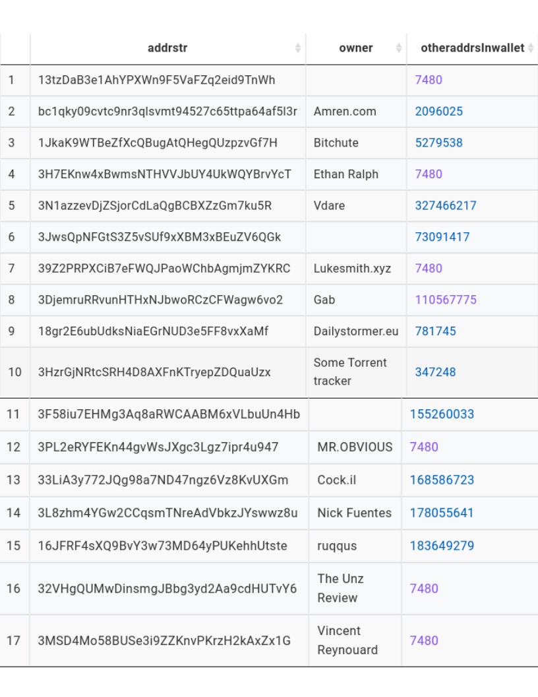

# The right-wing

### Summary

On January 6, 2021, thousands of former President Donald Trump's supporters gathered at the U.S. Capitol and attacked the United States Congress in an attempt to overturn his defeat in the 2020 United States presidential election. Reportedly, on Dec. 08. 2020, one month before this capitol riot, there was a large bitcoin transaction. The donor was a programmer based in France, and the receivers involved several far-right activists. Motivated by this incident, we were curious about the following questions:&#x20;

(1) identifying the receiver addresses, and determining if all addresses belong to different wallets;

(2) investigating who these riot wallets often sent money to and received money from.&#x20;

It was found that the common transitive closure heuristic for aggregating wallets may be more accurate in identifying wallets that belong to large trading websites and less accurate in distinguishing those that belong to individuals. In terms of behaviors, right-wing activists tend to transact with each other and gambling websites.

### Analysis Results

A [simple visualization website](https://admiring-pare-d28e68.netlify.app/docs/example/) was created for this project, and the analysis is discussed below.

#### **Address/Wallet owners**

Among all 23 addresses that occurred in the original transaction, 17 of them are in our database. Through wallet aggregation, it was found that the addresses belong to 12 different wallets (Figure 6). Indeed, most of them belong to right-wing activists. The reason that we could verify the ownership was through the website [BitcoinWhosWho](https://www.google.com/search?client=firefox-b-1-d\&q=bitcoin+whos+who), and some of them publicly broadcasted their addresses for people to donate.

However, as shown in Figure 6, the transitive closure wallet aggregation heuristic is more capable of identifying different transaction websites than individuals, that is, different individuals may be aggregated into the same wallet, while different transaction websites are correctly inferred as disparate wallets.

**Down-stream receivers/Up-stream senders of the riot wallets**

Overall, many of the wallets shown in Figure 6 are only receiving bitcoins, and have never sent bitcoins to others in our selected timestamp. Thus, overall, most wallets' in-degree > out-degree. The observation might be attributed to the factor that many alt-right activists are receiving donations through cryptocurrency because of the pseudo-anonymous property that cryptocurrency possesses.

Figure 7 displays the top 10 downstream and upstream wallets for each riot wallet. Right-wing figures were encoded in red; wallets that contain addresses that were discussed in Twitter were encoded yellow; wallets that possess addresses that were discussed in both Twitter and Medium were encoded green; wallets that contain addresses that belong to well-known transaction or gambling webs were encoded pink; wallets that contain addresses belong to a mixture of well-known webs are encoded purple; the wallet that has property summarized by our observation was encoded gray; the rest unknown wallets were encoded blue. Overall, the riot wallets are not only transacting bitcoins with each other but transacting with famous transaction websites.

