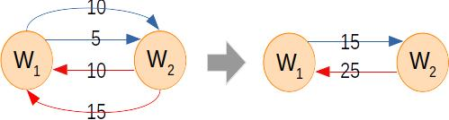

# Architecture design

[Figure 4](projects.md#fig4) illustrates the architecture design of the whole parser, file, and database system we used to decode the Bitcoin blockchain ledger into a simple wallet graph for analysis. The Blockchain Parser was Python-based, and it decoded the blockchain. The blockchain is encoded in bytes and split into multiple .dat files. The parser converted bytes into readable JSONs. Each block generated one JSON file containing block height, block timestamp, block difficulty, number of transactions within the block, and detailed transaction records.

Further, each JSON was split into multiple CSV files by the CSV Parser, and we processed the JSONs (i.e., blocks) in batches. For each batch, we included thousands of blocks. This specific batch would result in: one "blocks.csv", thousands of "transactions.csv"s, and thousands of "addresses.csv"s. "Blocks.csv" contained the information of all blocks in the batch. One batch generated thousands of "transactions.csv"s and "addresses.csv"s because every block would produce one transactions.csv and one addresses.csv. The former recorded all transactions included in the block, and the latter recorded all addresses that appeared in the block. The resulting CSVs were further inserted into an SQLite database.

The "addresses.csv"s were uniquely imported into the database such that we could create an address-ID lookup table. Originally, addresses were represented in long strings within transactions. Thus, we assigned address IDs to replace the address strings for computation efficiency. In addition, as we were not interested in the all-time transaction pattern, we let transaction tables inherit the timestamp information from block tables for later time-range filtration.


The address-ID lookup table and transaction tables with mapped address IDs were then exported. Next, we built an Edge-list-Parser to read transaction tables and create edge lists that represented the spent-together history of addresses. That is, there would be an edge between address ID = 1 and address ID = 2 if they could be spent together; thus, every transaction could produce one edge list. The Address Clusterizer then took the address-ID lookup table as input and streamed the edge lists to link address-IDs into clusters of wallets. As a result, the Clusterizer would generate an addressID-walletID lookup table. The Address Clusterizer implemented Weighted Quick Union with Path Compression (WQUPC) algorithm described in the Algorithm section.

After the addressID-walletID lookup table was generated, we inserted it back into the SQLite database. Further, we mutated a walletID column and mapped the walletIDs for each transaction table. Then, the transaction tables were exported and imported into a Neo4j graph database. As a result, every path in the walletID-transactionID-walletID graph ([Figure 2](projects.md#fig2)) corresponded to each row in the transaction tables. Next, we leveraged the built-in graph database commands to merge the inputs and outputs into one edge called “sent\_to” using the heuristic described in [Figure 3](projects.md#fig3). his walletID-walletID graph was further filtered for a time range of our interests. Finally, the wallet-wallet graph was grouped by "sender" and "receiver" (operated in a SQLite db), i.e., transaction values on the directed edges between a unique pair of "sender" and "receiver" were summed up ([Figure 5](projects.md#fig5)). This tidy wallet-wallet graph was later used for analysis.



### Commnads for constructing Neo4j databases



sample data for import into neo4j can be found [here](https://github.com/SzuHannah/bitcoin-data-process/tree/main/neo4jContainer)

```
// initiate a neo4j db called bitcoindb 
docker run --name bitcoindb -p7474:7474 -p7687:7687  -d -v /scratch/bitcoin/import/neo4jContainer:/var/lib/neo4j/import  -v bitcoindbdata:/data -v bitcoindblogs:/logs -v /scratch/bitcoin/plugins:/var/lib/neo4j/plugins  --env NEO4J_AUTH=neo4j/test --env NEO4J_dbms_memory_heap_initial__size=24g --env NEO4J_dbms_memory_heap_max__size=24g --env NEO4J_dbms_memory_pagecache_size=28g --env NEO4J_apoc_export_file_enabled=true --env NEO4J_apoc_import_file_enabled=true --env NEO4J_apoc_import_file_use__neo4j__config=true --env NEO4J_dbms_security_procedures_unrestricted=apoc.*,gds.* --env NEO4J_dbms_recovery_fail__on__missing__files=false --env NEO4JLABS_PLUGINS=\[\"apoc\"\,\"graph-data-science\"\] neo4j:latest

// execute and use docker command interface
docker start bitcoindb
docker exec -it bitcoindb bash
// go to import/ to check data is ready for import
cd import 
```



```
export DATA=import
./bin/neo4j-admin import --database neo4j --nodes=Transaction="$DATA/tx_header.csv,$DATA/containsTx/woh.*" --nodes=Wallet="$DATA/wallet_header.csv,$DATA/wallet.csv" --relationships=INPUT="$DATA/input_rel_header.csv,$DATA/input/woh.*" --relationships=OUTPUT="$DATA/output_rel_header.csv,$DATA/output/woh.*" --high-io=true --skip-duplicate-nodes=true
```



```
// add sent_to relationship and remove transaction node and the input output relationship
cypher-shell "call apoc.periodic.iterate('match (w1:Wallet)-[i:INPUT]->(t:Transaction)-[o:OUTPUT]->(w2:Wallet) return w1,i,t,o,w2','create (w1)-[s:SENT_TO{time:t.timestamp,value:(i.value/t.inputTotal)*o.value}]->(w2) detach delete t',{batchSize:10000,iterateList:true,parallel:false});"

// export wallet-wallet graph (filter transactions after 2017.01)
with "match (w1:Wallet)-[i:INPUT]->(t:Transaction)-[o:OUTPUT]->(w2:Wallet)
             where t.timestamp > datetime({year:2017, month: 1})
             return w1.walletID as sentwallet, w2.walletID as receivewallet, o.value as value, t.timestamp as time" as query
             call apoc.export.csv.query(query,"sent_to_2017.csv",{})
             YIELD file, source, format, nodes, relationships, properties, time, rows, batchSize, batches, done, data
             RETURN file, source, format, nodes, relationships, properties, time, rows, batchSize, batches, done, data;
```



```
// initiate db
docker run --name wallettxdb -p7474:7474 -p7687:7687  -d -v /scratch/bitcoin/import/neo4jContainer:/var/lib/neo4j/import  -v wallettxdbdata:/data -v wallettxdblogs:/logs -v /scratch/bitcoin/plugins:/var/lib/neo4j/plugins  --env NEO4J_AUTH=neo4j/pass --env NEO4J_dbms_memory_heap_initial__size=24g --env NEO4J_dbms_memory_heap_max__size=24g --env NEO4J_dbms_memory_pagecache_size=28g --env NEO4J_apoc_export_file_enabled=true --env NEO4J_apoc_import_file_enabled=true --env NEO4J_apoc_import_file_use__neo4j__config=true --env NEO4J_dbms_security_procedures_unrestricted=apoc.*,gds.* --env NEO4J_dbms_recovery_fail__on__missing__files=false --env NEO4JLABS_PLUGINS=\[\"apoc\",\"graph-data-science\"\] neo4j:3.5.21

// import the grouped wallet-wallet transaction data
exoprt DATA = imoprt
./bin/neo4j-admin import --database graph.db --nodes:Wallet "$DATA/wallet_header.csv,$DATA/wallet.csv" --relationships:SENT_TO "$DATA/groupedtx2017_header.csv,$DATA/groupedtx2017.csv" --high-io=true --ignore-duplicate-nodes=true
```


